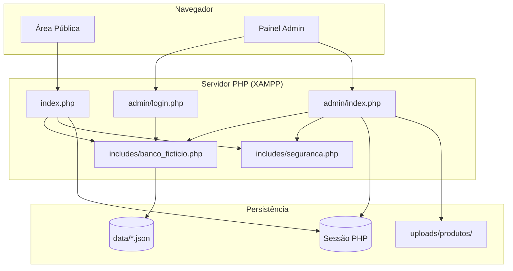

# Arquitetura do Sistema — Pixel Store

## 1. Padrão arquitetural

O sistema adota um **front controller monolítico** com roteamento por query string:

| Área | Front controller | Parâmetro | Views |
|------|------------------|-----------|-------|
| Pública | `index.php` | `?pg=` | `pages/*.php` |
| Admin | `admin/index.php` | `?pg=` | `admin/pages/*.php` |

Não há separação MVC formal — controllers e views estão acoplados.

---

## 2. Diagrama de arquitetura

---

## 3. Camadas

### 3.1 Apresentação

- **Loja:** HTML gerado em PHP com Tailwind via CDN; páginas parciais em `pages/`.
- **Admin:** HTML com CSS customizado (`admin.css`); páginas em `admin/pages/`.

### 3.2 Negócio

Distribuída entre:
- `index.php` — ações POST da loja (login, carrinho, checkout)
- `admin/pages/*.php` — CRUD inline com validações
- `includes/banco_ficticio.php` — regras de persistência

### 3.3 Dados

| Arquivo | Entidade |
|---------|----------|
| `produtos.json` | Produto |
| `categorias.json` | Categoria |
| `clientes.json` | Cliente |
| `usuarios.json` | Usuário admin |
| `fornecedores.json` | Fornecedor |
| `pedidos.json` | Pedido |

### 3.4 Sessão (não persistida)

| Chave | Conteúdo |
|-------|----------|
| `carrinho` | Array `[chave => quantidade]` |
| `cliente` | `{nome, login}` |
| `logado` | boolean (admin) |
| `usuario_nome` | string (admin) |
| `csrf_token` | string (gerado, não usado) |
| `mensagem_*`, `erro_*` | flash messages |

---

## 4. Roteamento

### Loja pública — páginas válidas

| pg | Arquivo | Descrição |
|----|---------|-----------|
| inicio | (inline index.php) | Hero banner |
| produtos | pages/produtos.php | Catálogo |
| detalhe | pages/detalhe.php | Detalhe (requer `id`) |
| carrinho | pages/carrinho.php | Carrinho |
| checkout | pages/checkout.php | Endereço (requer login) |
| login | pages/login.php | Login/registro |
| contato | pages/contato.php | Contato |
| beneficios | pages/beneficios.php | Benefícios |

### Admin — páginas válidas

| pg | Arquivo |
|----|---------|
| dashboard | admin/pages/dashboard.php |
| categorias | admin/pages/categorias.php |
| produtos | admin/pages/produtos.php |
| usuarios | admin/pages/usuarios.php |
| fornecedores | admin/pages/fornecedores.php |
| editar_categoria | admin/pages/editar_categoria.php |
| editar_usuario | admin/pages/editar_usuario.php |
| editar_fornecedor | admin/pages/editar_fornecedor.php |
| documentacao | admin/pages/documentacao.php |

**Arquivos órfãos/quebrados (existem mas não funcionam corretamente):**
- `admin/pages/editar_categorias.php` — copia errada de editar usuário
- `admin/pages/editar_fornecedores.php` — chama funções inexistentes
- `admin/pages/fornecedores_excluir.php` — chama `excluirFornecedor()` inexistente

---

## 5. Dependências externas (CDN)

| Recurso | URL | Uso |
|---------|-----|-----|
| Tailwind CSS | cdn.tailwindcss.com | Estilos loja |
| Phosphor Icons | unpkg.com/@phosphor-icons/web | Ícones |
| Google Fonts Sen | fonts.googleapis.com | Fonte |
| Unsplash | images.unsplash.com | Imagens seed dos produtos |

---

## 6. Requisitos de implantação

- PHP 7.4+ (usa `password_hash`, typed hints em funções)
- Apache com `mod_rewrite` opcional; `.htaccess` em `data/`
- Permissão de escrita em `data/` e `uploads/produtos/`
- Extensão PHP: `json`, `fileinfo` (mime_content_type)
