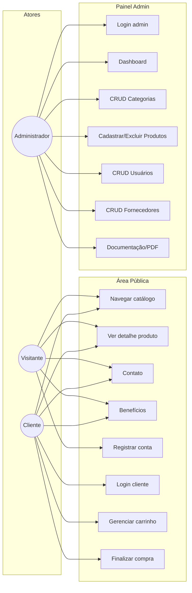
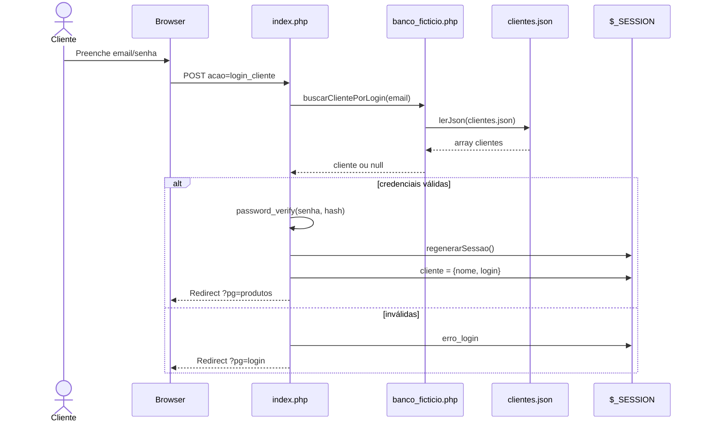
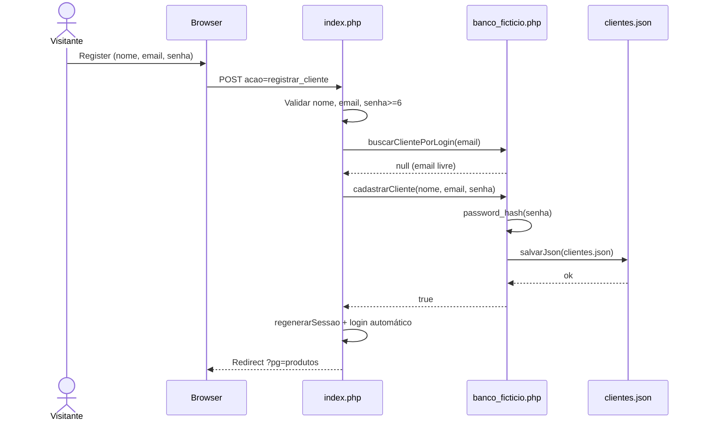
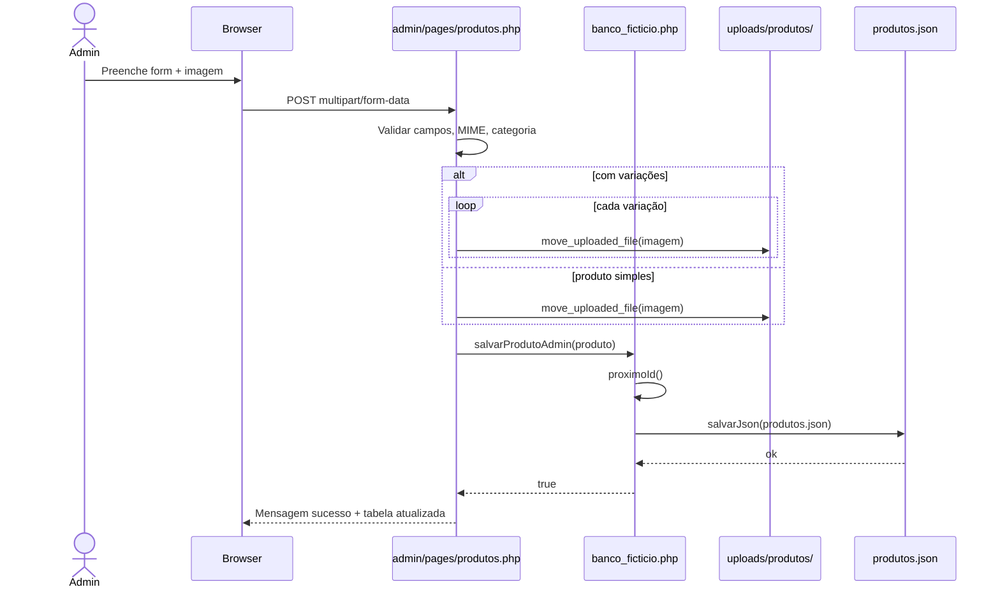
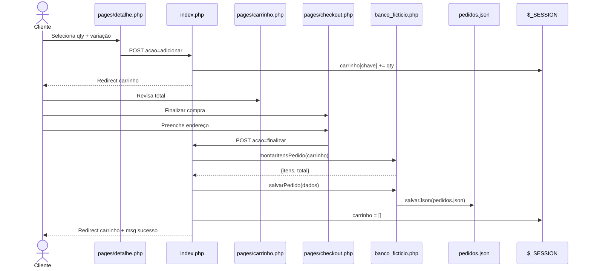
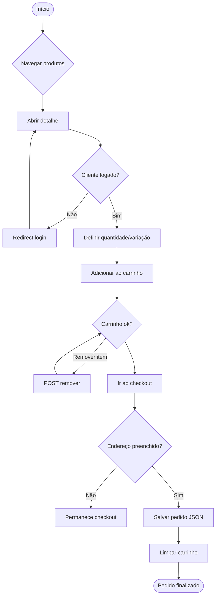
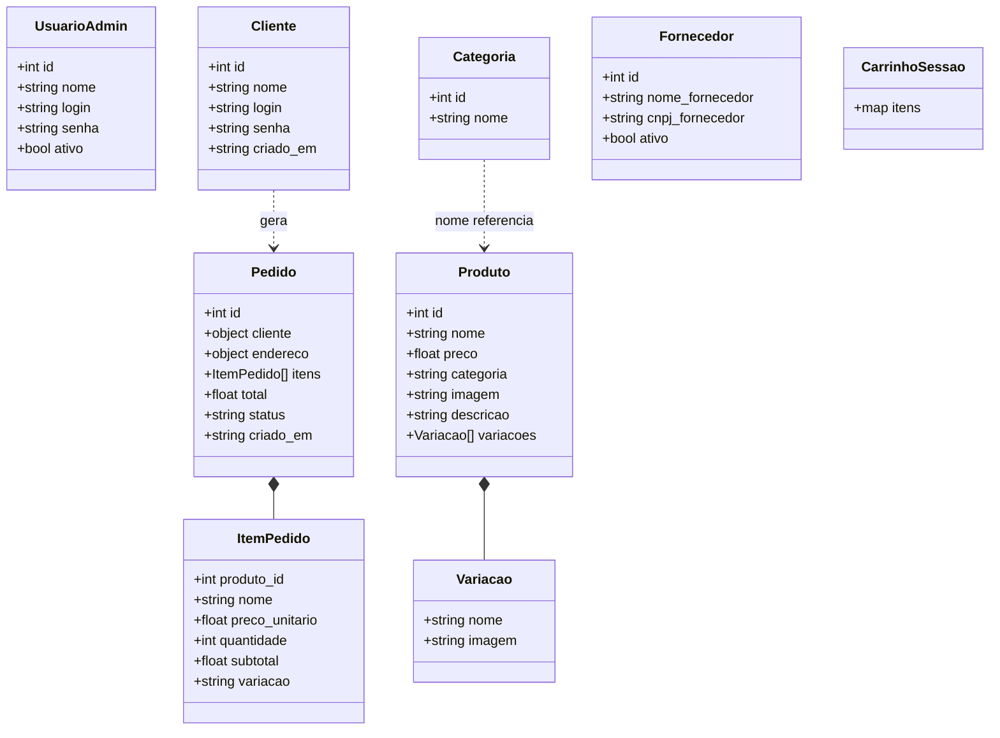
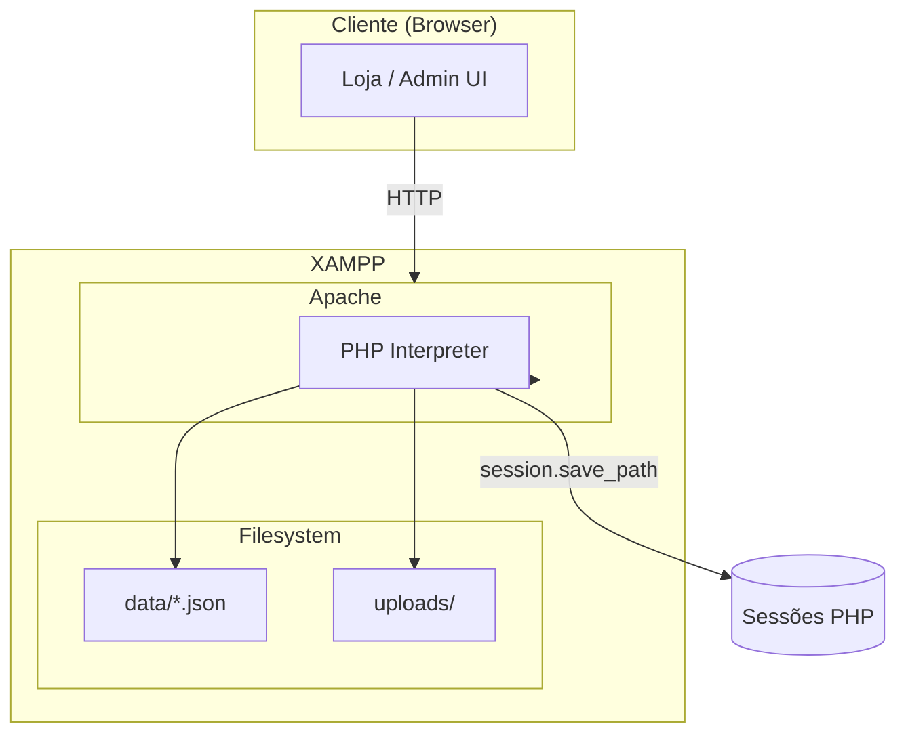
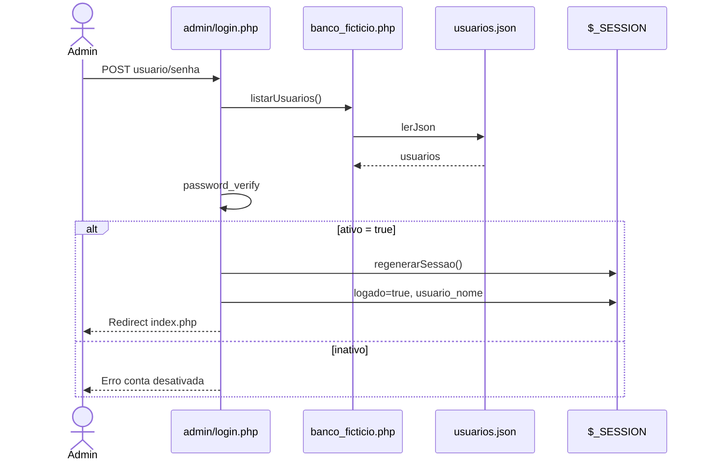

# Diagramas UML — Pixel Store

Diagramas em Mermaid baseados no código real.

---

## 1. Diagrama de casos de uso

---

## 2. Diagrama de sequência — Login cliente

---

## 3. Diagrama de sequência — Cadastro cliente

---

## 4. Diagrama de sequência — Cadastro de produto (admin)

---

## 5. Diagrama de sequência — Compra

---

## 6. Diagrama de atividades — Compra

---

## 7. Diagrama de classes/entidades

---

## 8. Diagrama de arquitetura (implantação)

---

## 9. Diagrama de sequência — Login administrador

