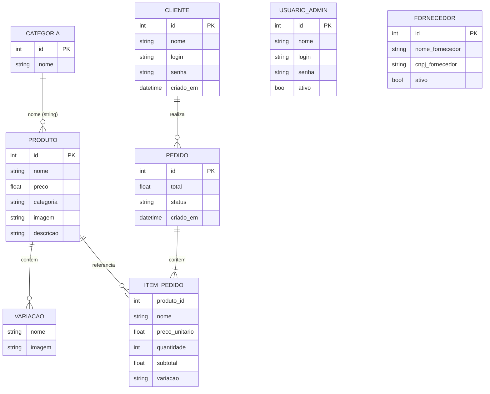

# Modelo de Dados e Entidades — Pixel Store

## 1. Visão geral

O sistema **não utiliza banco de dados relacional**. Todos os dados persistentes ficam em arquivos JSON na pasta `data/`. Estruturas temporárias (carrinho, sessão) ficam em `$_SESSION`.

---

## 2. Entidades persistidas

### 2.1 Usuário (Administrador)

| Campo | Descrição |
|-------|-----------|
| **Finalidade** | Autenticação no painel admin |
| **Origem** | `data/usuarios.json` |
| **Utilizada em** | `admin/login.php`, CRUD usuários |
| **Relacionamentos** | Nenhum formal no código |

**Campos:** `id`, `nome`, `login`, `senha` (hash), `ativo`

---

### 2.2 Cliente

| Campo | Descrição |
|-------|-----------|
| **Finalidade** | Autenticação na loja e identificação em pedidos |
| **Origem** | `data/clientes.json` |
| **Utilizada em** | Registro/login loja, pedidos |
| **Relacionamentos** | 1:N com Pedido (embutido no pedido, sem FK) |

**Campos:** `id`, `nome`, `login` (email), `senha` (hash), `criado_em`

---

### 2.3 Categoria

| Campo | Descrição |
|-------|-----------|
| **Finalidade** | Agrupar produtos |
| **Origem** | `data/categorias.json` |
| **Utilizada em** | Admin CRUD, select no cadastro de produto, filtro público |
| **Relacionamentos** | Referenciada por Produto via **nome** (string), não por ID |

**Campos:** `id`, `nome`

---

### 2.4 Produto

| Campo | Descrição |
|-------|-----------|
| **Finalidade** | Item comercializado na loja |
| **Origem** | `data/produtos.json` |
| **Utilizada em** | Catálogo, detalhe, carrinho, pedidos |
| **Relacionamentos** | Categoria (por nome); Variações (embutidas) |

**Campos:** `id`, `nome`, `preco`, `categoria`, `imagem`, `descricao`, `variacoes[]`

---

### 2.5 Variação (embutida em Produto)

| Campo | Descrição |
|-------|-----------|
| **Finalidade** | Opções do produto (tamanho, cor, modelo) |
| **Origem** | Array dentro de produto |
| **Utilizada em** | Detalhe, carrinho, pedido |
| **Relacionamentos** | Pertence a Produto |

**Campos:** `nome`, `imagem`

---

### 2.6 Fornecedor

| Campo | Descrição |
|-------|-----------|
| **Finalidade** | Cadastro comercial de parceiros |
| **Origem** | `data/fornecedores.json` |
| **Utilizada em** | Admin CRUD |
| **Relacionamentos** | **Nenhum** — não vinculado a produtos |

**Campos:** `id`, `nome_fornecedor`, `cnpj_fornecedor`, `telefone_fornecedor`, `cep_fornecedor`, `rua_fornecedor`, `numero_fornecedor`, `bairro_fornecedor`, `cidade_fornecedor`, `ativo`

---

### 2.7 Pedido

| Campo | Descrição |
|-------|-----------|
| **Finalidade** | Registro de compra finalizada |
| **Origem** | `data/pedidos.json` |
| **Utilizada em** | Checkout, dashboard (listagem parcial) |
| **Relacionamentos** | Cliente e itens embutidos |

**Campos:** `id`, `cliente`, `endereco`, `itens[]`, `total`, `status`, `criado_em`

---

### 2.8 Item de pedido (embutido)

**Campos:** `produto_id`, `nome`, `preco_unitario`, `quantidade`, `subtotal`, `variacao`

---

## 3. Estruturas em sessão (não persistidas)

| Estrutura | Chave sessão | Finalidade |
|-----------|--------------|------------|
| Carrinho | `carrinho` | `{ "produtoId" ou "produtoId:varIdx" => qty }` |
| Cliente logado | `cliente` | `{ nome, login }` — sem senha |
| Admin logado | `logado`, `usuario_nome` | Controle de acesso |
| Flash messages | `mensagem_*`, `erro_*` | Feedback ao usuário |
| CSRF | `csrf_token` | Token gerado (não utilizado) |

---

## 4. Diagrama entidade-relacionamento (conceitual)

**Observações do diagrama:**
- `FORNECEDOR` e `USUARIO_ADMIN` são entidades isoladas sem FK
- Relação Categoria-Produto é **fraca** (string, não ID)
- Pedido armazena snapshot dos dados (desnormalizado)

---

## 5. Armazenamento físico

| Arquivo | Formato | Escrita |
|---------|---------|---------|
| `data/*.json` | Array de objetos JSON | `salvarJson()` com LOCK_EX |
| `uploads/produtos/*` | Binário (imagens) | `move_uploaded_file()` |
| Sessão PHP | Serializado pelo PHP | Automático |

---

## 6. Tabela de arquivos de dados

| Arquivo | Entidade principal | Operações |
|---------|-------------------|-----------|
| usuarios.json | Usuário admin | CRUD |
| clientes.json | Cliente | Create (auto-registro) |
| categorias.json | Categoria | CRUD |
| produtos.json | Produto | Create, Read, Delete |
| fornecedores.json | Fornecedor | CRUD |
| pedidos.json | Pedido | Create, Read parcial |
